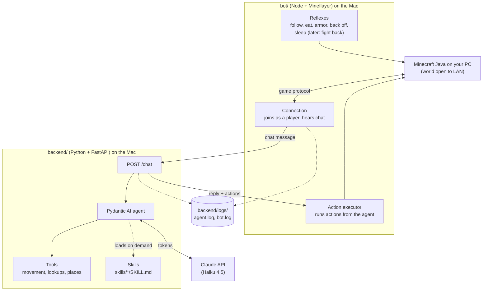
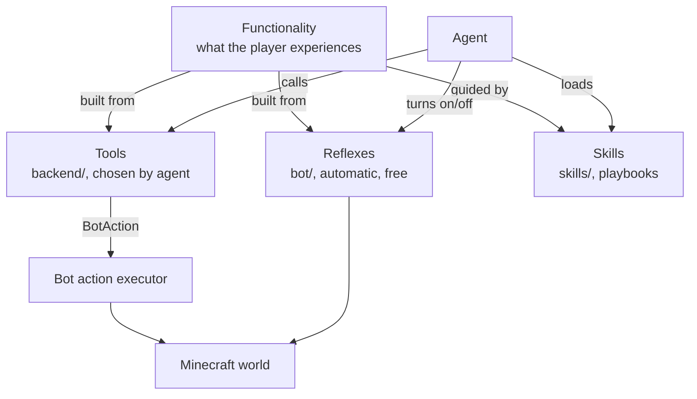
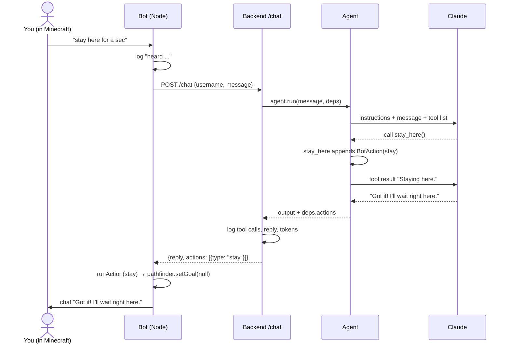
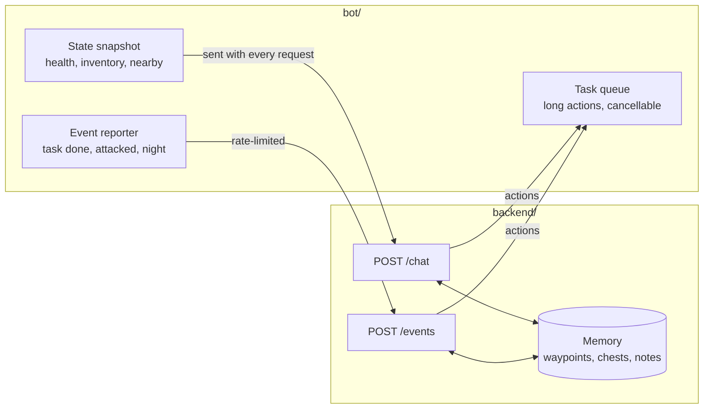

# Architecture

How the minecraft-agent is put together: the two processes, how a message flows through them, and the vocabulary we use (agent, tool, skill, reflex, functionality).

For quick definitions of any term, see [glossary.md](glossary.md). Diagrams are Mermaid. They render on GitHub, and in VS Code with a Mermaid preview extension.

---

## 1. The big picture



There are two processes, and they split the work like this:

| | `bot/` (Node) | `backend/` (Python) |
|---|---|---|
| **Job** | The body: be in the world, move, sense, act | The brain: understand chat and decide what to do |
| **Library** | [Mineflayer](https://github.com/PrismarineJS/mineflayer) and its plugins | FastAPI + [Pydantic AI](https://ai.pydantic.dev) |
| **Talks to** | Minecraft server, backend | Claude API, bot (by replying) |
| **Costs tokens?** | Never | Yes, on every agent run |
| **Speed** | Every game tick (50 ms) | Seconds per decision |

**Why two processes?** Mineflayer, the most complete Minecraft bot library, is JavaScript. Pydantic AI, the agent framework, is Python. Keeping them apart also gives a clean rule: anything that must happen fast or often lives in the bot, and anything that needs judgment lives in the backend.

---

## 2. Vocabulary

These words get mixed up easily, so here's what each means in this project.

### Agent

The **agent** is the decision-maker: one `pydantic_ai.Agent` in `backend/app/agents/agent.py`. On each run it gets:

- **Instructions**: who it is (a friendly companion) and how to reply (short, plain text).
- **The message**: `"TScoms23: follow me"`.
- **Deps**: per-request data (`ChatDeps`: who's talking, the bot's state, saved places, and a list where tools record actions).
- **Recent conversation**: the player's last 5 exchanges, including the tool calls, forgotten after 10 minutes of quiet (`services/memory.py`). That's what makes "get it" after "there's coal below us" work. Tool calls have to stay in: with the replies alone, the model learns that saying "on my way!" is enough and stops calling tools.
- **Tools and skills** it may use.

It sends all of this to Claude, runs any tools Claude asks for, and repeats until Claude produces a final text reply. One player message is one **agent run**, which may make several model requests.

There is one agent today. More can be added later (for example, a planner agent for long goals), but one is enough until the instructions get crowded.

### Tool

A **tool** is a Python function the agent can choose to call. Claude sees its name, docstring and parameters, and decides whether to use it.

```python
@agent.tool
def stay_here(ctx: RunContext[ChatDeps]) -> str:
    """Stop following and stand still where you are."""
    ctx.deps.actions.append(BotAction(type='stay'))
    return 'Staying here.'
```

In this project, tools come in two kinds:

- **Action tools** change the world. They don't touch Minecraft directly, because the backend can't. They append a `BotAction` that is sent back to the bot in the `/chat` response, and the bot carries it out. Examples: `follow_player`, `stay_here`.
- **Query tools** read the world: `check_inventory`, `look_around`, `nearby_entities`, `where_are_we`. They read the state snapshot the bot sends with each request (formatted by `app/services/world.py`), so they never call back into the bot. Health, food, position, time and weather are also added to the agent's instructions on every run.

A tool should be **one clear action** with a description precise enough for Claude to know when to use it. Tool definitions are sent on every request, so each new tool adds a few tokens per message.

### Skill

A **skill** is knowledge, not code: a `SKILL.md` file under `skills/` describing *how* to do something multi-step, such as surviving the first night or getting iron gear.

```
skills/
  survive-first-night/
    SKILL.md      ← name + description in frontmatter, then the playbook
```

On each run the agent sees only each skill's **name and one-line description**. When it decides a skill is relevant, it calls `load_capability` (provided by the `Skills` capability from `pydantic-ai-harness`), and the full playbook is added to its context for that run. That keeps per-message token cost low while letting it know a lot.

Skills tell the agent **what order to do things in**; tools are **how it does each step**. A skill can say "craft a stone pickaxe, then mine iron"; the agent then calls `craft_item` and `mine_block` tools to make it happen.

### Reflex

A **reflex** is behavior that runs in the bot on its own: no backend call, no Claude, no tokens. It's triggered by game events or timers.

Following the player is a reflex: `mineflayer-pathfinder` keeps the bot within 3 blocks of you every tick. The agent only switches it on or off.

The survival reflexes in `bot/survival.js` are the same kind of thing: eating, putting on armor, backing off from mobs when hurt, getting out of lava, fire and deep water, and sleeping when you sleep. Two rules keep them from fighting with what you asked for:

- **Your command wins.** Any action from the agent cancels a running reflex (`survival.cancel()`) and the current job (`cancelTask()`).
- **A reflex finishes, then hands back.** While one is driving, the follow logic stays out of the way (`survival.busy()`); when it's done, the bot goes back to following or standing still (`resume()`). If a reflex interrupts a gathering job (say, backing off from a zombie), the job waits and then carries on.

Use a reflex when the behavior is:

- **Time-critical**: dodging a creeper can't wait 2 seconds for a model reply.
- **Frequent**: eating, picking up items, following.
- **Obvious**: no judgment needed, so paying for a model call would be waste.

### Functionality

A **functionality** is something the player experiences, such as "the bot follows me" or "the bot gets me iron armor". It isn't a code unit; it's built from the pieces above:

| Functionality | Reflex (bot) | Tool (agent) | Skill |
|---|---|---|---|
| Follows me around | Pathfinder keeps 3 blocks away | `follow_player`, `stay_here` toggle it | — |
| Survives the first night *(today: advice only)* | — | — | `survive-first-night` |
| Stays alive while playing | Eat, wear armor, back off when hurt, sleep when you sleep | `recover_items` after dying | — |
| Gets me 10 logs | Use the right tool, pick up drops, back off if hurt | `collect("log", 10)` | — |
| Makes me a stone pickaxe | Eat, back off if hurt | `make_item("stone_pickaxe")`, which gathers and crafts the whole chain | `tool-progression` |
| Gets a full set of iron gear *(planned)* | Eat, fight back, pick up drops | `mine_block`, `craft_item`, `smelt` | `iron-gear` |

The full list is in [survival-functionality-plan.md](survival-functionality-plan.md).

### Capability (Pydantic AI term)

A **capability** is Pydantic AI's way to bundle instructions, tools and hooks and plug them into an agent with `capabilities=[...]`. `Skills(...)` is a capability. When the tool list grows, we'll group related tools (movement, combat, crafting) into capabilities or toolsets so each stays manageable.

### How they relate



---

## 3. What happens when you chat



Meanwhile, with no chat at all, the follow reflex keeps running in the bot. That's why following costs nothing.

The bot only reacts to **real player chat** (the `playerChat` packet, with the sender's UUID and the plain message). It ignores server messages, including the `[Steve: Gave 16 [Bread] to Claude]` lines every operator sees when someone runs a command. Mineflayer's own `chat` event matches those too, which would turn every command into a paid agent run.

---

## 4. Where code lives

```
bot/
  index.js                   connection, reconnect, logging, follow reflex, action executor
  state.js                   state snapshot sent with each chat
  alerts.js                  chat warnings: low health, creeper nearby, nightfall
  movements.js               pathfinder rules: no digging, safe drops, doors and gates
  survival.js                reflexes: eat, armor, back off when hurt, escape lava/fire/water, sleep, item recovery
  tasks.js                   the current job (one at a time, cancellable, with progress)
  gathering.js               collect and give jobs: what to break for an item, protected areas
  crafting.js                make jobs: recipe chains, smelting, placing and picking up workstations
  walk.js                    walking with a time limit, for every walk inside a job or reflex
  test/                      unit tests (npm test), no Minecraft needed
  scripts/                   in-game checks with a second player (npm run check:*)
  patches/                   fixes to npm packages, applied by patch-package on npm install
backend/app/
  main.py                    FastAPI app, sets up logging at startup
  core/config.py             settings from .env (model, API key, ports)
  core/logging.py            writes backend/logs/agent.log
  core/errors.py             turns failures into chat-friendly error messages
  agents/agent.py            the agent, ChatDeps, and its tools
  routes/chat.py             POST /chat: runs the agent, logs, returns reply + actions
  services/world.py          turns the bot's state snapshot into text for the agent
  services/places.py         named places, saved per world to backend/data/worlds/<id>/places.json
  services/memory.py         each player's recent exchanges, in memory only
backend/data/                things the agent remembers between runs (gitignored)
  schema/chat.py             ChatRequest, ChatResponse, BotAction
skills/
  <name>/SKILL.md            playbooks the agent loads on demand
backend/logs/
  agent.log                  agent runs: messages, tool calls, replies, tokens
  bot.log                    bot actions: joins, chat, movement, reflexes, jobs and blocks dug, deaths, errors
  bot-console.log            raw bot console output (library warnings)
```

### The bot ↔ backend contract

Everything between the two processes goes through `POST /chat`:

```jsonc
// request (bot → backend); state is built by bot/state.js
{ "username": "TScoms23", "message": "stay here",
  "state": { "health": 18, "food": 15, "position": {"x": 0, "y": 64, "z": 0},
             "dimension": "overworld", "time_of_day": 6000, "raining": false, "thundering": false,
             "held_item": null, "inventory": [...], "nearby_blocks": [...], "nearby_entities": [...],
             "player_position": {...}, "player_distance": 4.5,
             "last_death": null,      // or {position, dimension, seconds_ago} for 5 minutes after dying
             "task": null } }         // or {description: "getting 20 cobblestone", progress: "12/20"}

// response (backend → bot)
{ "reply": "Got it!", "actions": [{ "type": "stay", "username": null }] }
// action types: follow, stay, come, goto (x, y?, z, label?), teleport, recover,
//               collect (item, count), give (username, item, count?), make (item, count)
```

When something fails, the backend answers with an error status and `{ "error": "Claude is rate limiting me. Try again in a moment." }`. The message is written for the player (`app/core/errors.py`). The bot says it in chat as `Error: ...` and writes the full details to the logs. The bot reports its own failures the same way: backend unreachable or slow, an action that throws, an unexpected crash. Repeats of the same error are muted for 10 seconds.

When adding an action, change both sides together: add the type to `BotAction` in `schema/chat.py` and handle it in `runAction` in `bot/index.js`. The bot logs a warning for any action type it doesn't know.

---

## 5. Adding new behavior: which piece?

| Question | If yes, put it in... |
|---|---|
| Must it react within a second, or run constantly? | A **reflex** in `bot/` |
| Does the player ask for it, or does it need judgment? | A **tool** in the backend, plus an action handler in the bot |
| Is it a multi-step plan or game knowledge? | A **skill** in `skills/` |
| Does it need to know the world state? | Add it to the snapshot in `bot/state.js` and `BotState` in `schema/chat.py` |

Most functionalities need two or three of these. A typical new action:

1. Bot: implement it with Mineflayer (e.g. `gathering.collect({ item, count })`).
2. Schema: add the action type to `BotAction`.
3. Backend: add a tool that appends the action, with a clear docstring.
4. Bot: handle the new type in `runAction`.
5. Optionally, add or update a skill that uses the tool in a larger plan.

---

## 6. Where the architecture needs to grow

The current design works for instant actions like follow and stay. Survival play needs more:



1. **Task queue in the bot.** *Partly done:* one job at a time with progress, cancel and a result in chat (`bot/tasks.js`). A queue of several jobs is still to come.
2. **State snapshot** ✅. Each request includes health, hunger, position, time, inventory and nearby points of interest, so the agent decides with real information instead of guessing.
3. **Events endpoint.** The bot calls `POST /events` when something needs a decision (a task finished, it's under attack). Events cost tokens, so the bot handles anything a reflex can, and rate-limits the rest.
4. **Memory.** Named places are done (`services/places.py`); the bot also remembers where it last died, in memory only. Still to come: chest contents and notes about the player, stored by the backend so they survive restarts.
5. **Tool groups.** As tools multiply, group them (movement, gathering, crafting, combat) into toolsets or capabilities, so the agent's tool list stays readable and each group can be tested on its own.

---

## 7. Patched dependencies

`mineflayer-pathfinder` 2.4.5 has door support, but it's off by default and doesn't work properly:

- It only opens fence gates, and treats every door, open or closed, as a wall. `bot/movements.js` fixes this by checking each door's and gate's actual state.
- After opening a gate or door, it stays in "placing a block" mode. If the bot carries dirt or cobblestone, it then throws on every tick.
- When it smooths a finished route, it puts any step that passes through a door or gate on top of the door's thin panel, a jump the bot can't make. The bot then stands still in front of an open door forever.

`bot/patches/mineflayer-pathfinder+2.4.5.patch` fixes both, and `patch-package` reapplies it on every `npm install`.

If you upgrade `mineflayer-pathfinder`, check whether the patch is still needed. `npm install` fails loudly if it no longer applies.

---

## 8. Limits that keep the bot stable

- **One block at a time, 45 seconds each.** A gathering job gives up on a block it can't reach in 45 seconds and tries another, so the pathfinder can't stall a job by re-planning forever.
- **Every walk inside a job or reflex has a time limit** (`bot/walk.js`): the pathfinder never gives up on its own. Going back for items after dying gets 90 seconds, each dropped item 10, a workstation 60. Trips the player asks for ("go to …") have no limit; "stop" ends them.
- **The bot mines blocks itself** (walk, equip, dig, pick up drops for up to 5 seconds) instead of using `mineflayer-collectblock`, which waited forever for a drop it couldn't reach and froze jobs.
- **Path search radius during jobs.** With digging allowed, almost every block is a possible route, and an unbounded path search ran the bot out of memory (4 GB) once. During jobs the pathfinder only searches 80 blocks around the bot; targets are never more than 48 away.
- **Dying cancels the job.** The items are gone and the bot respawns somewhere else.
- **60 steps per make job.** Every gather, craft, smelt and placement counts; a chain that runs away gives up with a message instead of looping.
- **Unreachable blocks are remembered for 5 minutes**, across jobs, so the bot doesn't keep climbing the same half-chopped tree. It also prefers blocks near its own height over logs high in a canopy.
- **The inventory gets a moment to catch up after each craft.** `bot.craft` can return before the server's inventory update arrives; counting too early made the next craft fail.
