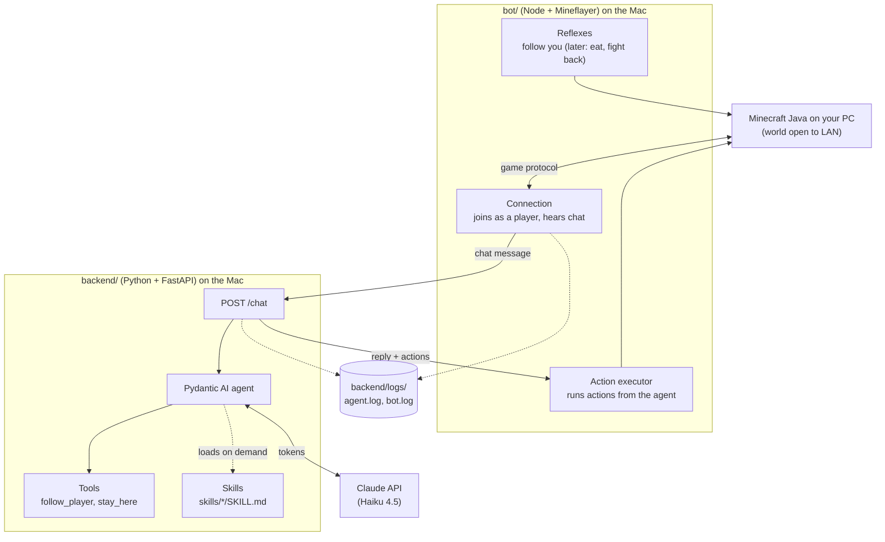
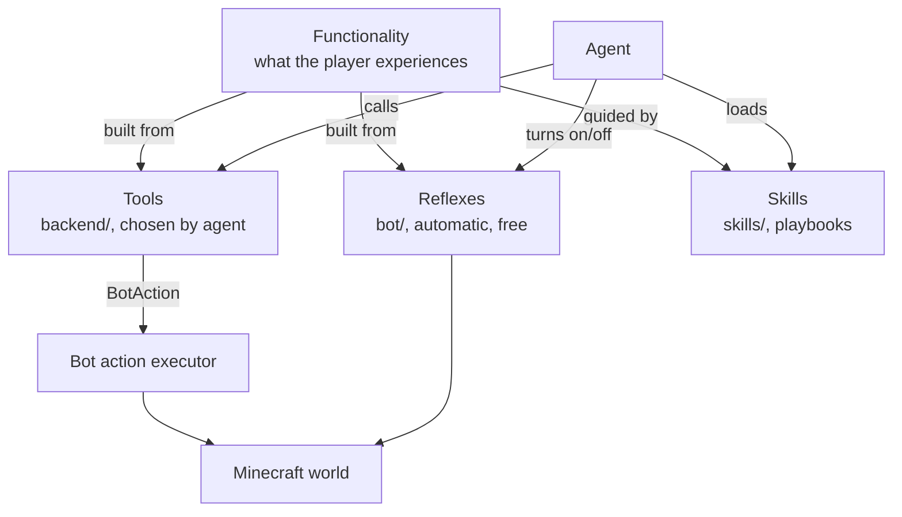
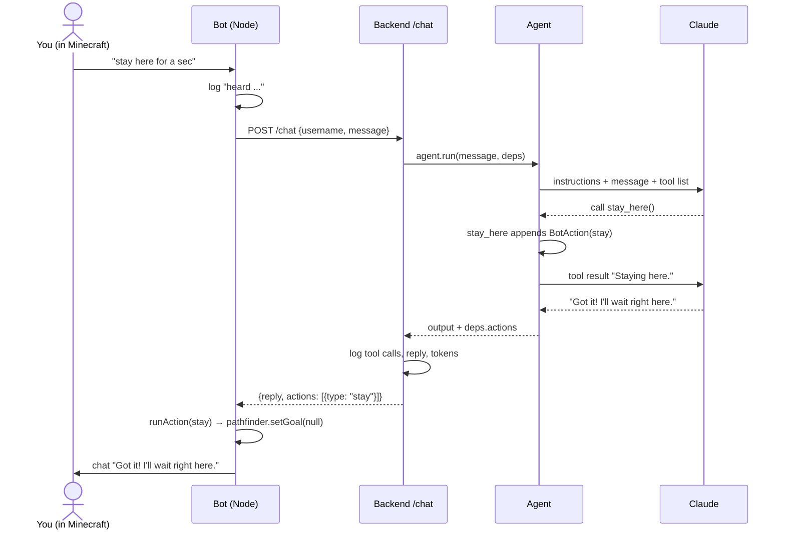
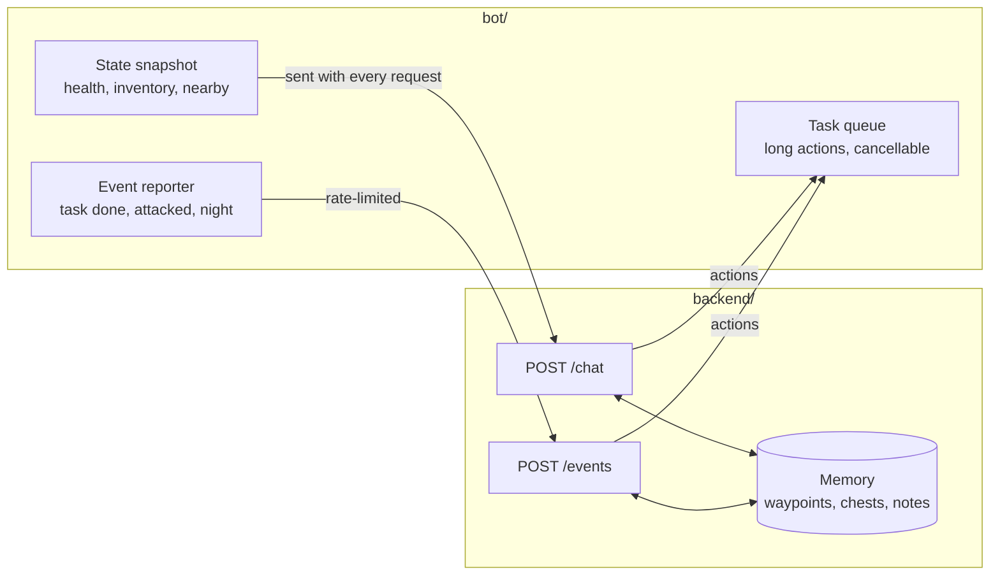

# Architecture

How the minecraft-agent is put together: the two processes, how a message flows through them, and the vocabulary we use (agent, tool, skill, reflex, functionality).

For quick definitions of any term, see [glossary.md](glossary.md). Diagrams are Mermaid. They render on GitHub, and in VS Code with a Mermaid preview extension.

---

## 1. The big picture



There are two processes, and they split the work like this:

| | `bot/` (Node) | `backend/` (Python) |
|---|---|---|
| **Job** | The body: be in the world, move, sense, act | The brain: understand chat and decide what to do |
| **Library** | [Mineflayer](https://github.com/PrismarineJS/mineflayer) and its plugins | FastAPI + [Pydantic AI](https://ai.pydantic.dev) |
| **Talks to** | Minecraft server, backend | Claude API, bot (by replying) |
| **Costs tokens?** | Never | Yes, on every agent run |
| **Speed** | Every game tick (50 ms) | Seconds per decision |

**Why two processes?** Mineflayer, the most complete Minecraft bot library, is JavaScript. Pydantic AI, the agent framework, is Python. Keeping them apart also gives a clean rule: anything that must happen fast or often lives in the bot, and anything that needs judgment lives in the backend.

---

## 2. Vocabulary

These words get mixed up easily, so here's what each means in this project.

### Agent

The **agent** is the decision-maker: one `pydantic_ai.Agent` in `backend/app/agents/agent.py`. On each run it gets:

- **Instructions**: who it is (a friendly companion) and how to reply (short, plain text).
- **The message**: `"TScoms23: follow me"`.
- **Deps**: per-request data (`ChatDeps`: who's talking, plus a list where tools record actions).
- **Tools and skills** it may use.

It sends all of this to Claude, runs any tools Claude asks for, and repeats until Claude produces a final text reply. One player message is one **agent run**, which may make several model requests.

There is one agent today. More can be added later (for example, a planner agent for long goals), but one is enough until the instructions get crowded.

### Tool

A **tool** is a Python function the agent can choose to call. Claude sees its name, docstring and parameters, and decides whether to use it.

```python
@agent.tool
def stay_here(ctx: RunContext[ChatDeps]) -> str:
    """Stop following and stand still where you are."""
    ctx.deps.actions.append(BotAction(type='stay'))
    return 'Staying here.'
```

In this project, tools come in two kinds:

- **Action tools** change the world. They don't touch Minecraft directly, because the backend can't. They append a `BotAction` that is sent back to the bot in the `/chat` response, and the bot carries it out. Examples: `follow_player`, `stay_here`.
- **Query tools** (planned) read the world: inventory, nearby blocks, position. They'll get their data from the state snapshot the bot sends with each request.

A tool should be **one clear action** with a description precise enough for Claude to know when to use it. Tool definitions are sent on every request, so each new tool adds a few tokens per message.

### Skill

A **skill** is knowledge, not code: a `SKILL.md` file under `skills/` describing *how* to do something multi-step, such as surviving the first night or getting iron gear.

```
skills/
  survive-first-night/
    SKILL.md      ← name + description in frontmatter, then the playbook
```

On each run the agent sees only each skill's **name and one-line description**. When it decides a skill is relevant, it calls `load_capability` (provided by the `Skills` capability from `pydantic-ai-harness`), and the full playbook is added to its context for that run. That keeps per-message token cost low while letting it know a lot.

Skills tell the agent **what order to do things in**; tools are **how it does each step**. A skill can say "craft a stone pickaxe, then mine iron"; the agent then calls `craft_item` and `mine_block` tools to make it happen.

### Reflex

A **reflex** is behavior that runs in the bot on its own: no backend call, no Claude, no tokens. It's triggered by game events or timers.

Following the player is a reflex: `mineflayer-pathfinder` keeps the bot within 3 blocks of you every tick. The agent only switches it on or off.

Use a reflex when the behavior is:

- **Time-critical**: dodging a creeper can't wait 2 seconds for a model reply.
- **Frequent**: eating, picking up items, following.
- **Obvious**: no judgment needed, so paying for a model call would be waste.

### Functionality

A **functionality** is something the player experiences, such as "the bot follows me" or "the bot gets me iron armor". It isn't a code unit; it's built from the pieces above:

| Functionality | Reflex (bot) | Tool (agent) | Skill |
|---|---|---|---|
| Follows me around | Pathfinder keeps 3 blocks away | `follow_player`, `stay_here` toggle it | — |
| Survives the first night *(today: advice only)* | — | — | `survive-first-night` |
| Gets me 10 logs *(planned)* | Auto-equip axe | `collect_block("oak_log", 10)` | — |
| Gets a full set of iron gear *(planned)* | Eat, fight back, pick up drops | `mine_block`, `craft_item`, `smelt` | `iron-gear` |

The full list is in [survival-functionality-plan.md](survival-functionality-plan.md).

### Capability (Pydantic AI term)

A **capability** is Pydantic AI's way to bundle instructions, tools and hooks and plug them into an agent with `capabilities=[...]`. `Skills(...)` is a capability. When the tool list grows, we'll group related tools (movement, combat, crafting) into capabilities or toolsets so each stays manageable.

### How they relate



---

## 3. What happens when you chat



Meanwhile, with no chat at all, the follow reflex keeps running in the bot. That's why following costs nothing.

---

## 4. Where code lives

```
bot/
  index.js                   connection, logging, reflexes, action executor
backend/app/
  main.py                    FastAPI app, sets up logging at startup
  core/config.py             settings from .env (model, API key, ports)
  core/logging.py            writes backend/logs/agent.log
  agents/agent.py            the agent, ChatDeps, and its tools
  routes/chat.py             POST /chat: runs the agent, logs, returns reply + actions
  schema/chat.py             ChatRequest, ChatResponse, BotAction
skills/
  <name>/SKILL.md            playbooks the agent loads on demand
backend/logs/
  agent.log                  agent runs: messages, tool calls, replies, tokens
  bot.log                    bot actions: joins, chat, follow/stay, deaths, errors
  bot-console.log            raw bot console output (library warnings)
```

### The bot ↔ backend contract

Everything between the two processes goes through `POST /chat`:

```jsonc
// request (bot → backend)
{ "username": "TScoms23", "message": "stay here" }

// response (backend → bot)
{ "reply": "Got it!", "actions": [{ "type": "stay", "username": null }] }
```

When adding an action, change both sides together: add the type to `BotAction` in `schema/chat.py` and handle it in `runAction` in `bot/index.js`. The bot logs a warning for any action type it doesn't know.

---

## 5. Adding new behavior: which piece?

| Question | If yes, put it in... |
|---|---|
| Must it react within a second, or run constantly? | A **reflex** in `bot/` |
| Does the player ask for it, or does it need judgment? | A **tool** in the backend, plus an action handler in the bot |
| Is it a multi-step plan or game knowledge? | A **skill** in `skills/` |
| Does it need to know the world state? | Add it to the state snapshot the bot sends (planned) |

Most functionalities need two or three of these. A typical new action:

1. Bot: implement it with Mineflayer (e.g. `collectBlock(type, count)`).
2. Schema: add the action type to `BotAction`.
3. Backend: add a tool that appends the action, with a clear docstring.
4. Bot: handle the new type in `runAction`.
5. Optionally, add or update a skill that uses the tool in a larger plan.

---

## 6. Where the architecture needs to grow

The current design works for instant actions like follow and stay. Survival play needs more:



1. **Task queue in the bot.** "Mine 20 cobblestone" takes minutes. Actions become tasks with an id, progress, cancel, and a result. `stop` cancels the current task.
2. **State snapshot.** Each request includes health, hunger, position, time, inventory and nearby points of interest, so the agent decides with real information instead of guessing.
3. **Events endpoint.** The bot calls `POST /events` when something needs a decision (a task finished, it's under attack). Events cost tokens, so the bot handles anything a reflex can, and rate-limits the rest.
4. **Memory.** Waypoints, chest contents and notes about the player, stored by the backend so they survive restarts.
5. **Tool groups.** As tools multiply, group them (movement, gathering, crafting, combat) into toolsets or capabilities, so the agent's tool list stays readable and each group can be tested on its own.
