# Pydantic AI: Agents, Tools, Capabilities, Skills & Harness

How the pieces of the Pydantic AI stack fit together, and how we use them in `agent-app`.

> **Versions:** `pydantic-ai` 2.52 · `pydantic-ai-harness` 0.52. Diagrams are Mermaid. They render on GitHub, and in VS Code with a Mermaid preview extension.

---

## 1. The big picture

Everything is built from one primitive: the **Agent**. Everything else plugs into it.

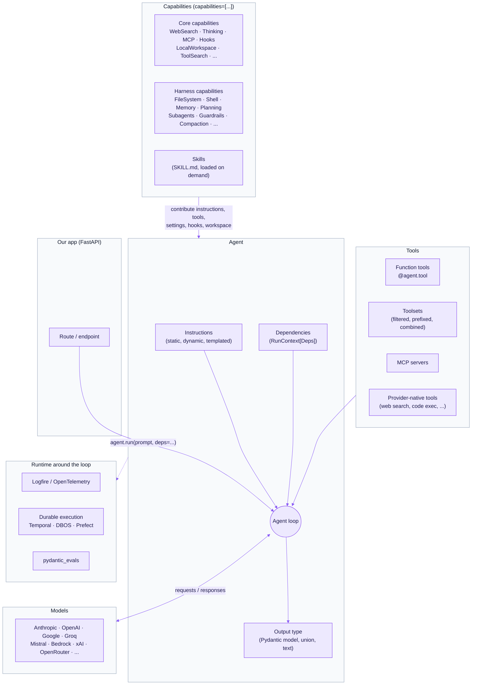

**The short version:**

| Concept | What it is | Where it comes from |
|---|---|---|
| **Agent** | A typed loop: send messages to a model, run the tools it calls, validate the output, repeat | `pydantic_ai.Agent` |
| **Tool** | A function the model can call | `@agent.tool`, toolsets, MCP, provider-native |
| **Toolset** | A group of tools you can filter, rename, prefix, or combine | `pydantic_ai.toolsets` |
| **Capability** | A self-contained bundle of agent behavior: instructions + tools + settings + lifecycle hooks | `pydantic_ai.capabilities` (core) and `pydantic_ai_harness` |
| **Skill** | A `SKILL.md` file of procedural instructions that the model loads only when it needs them | `pydantic_ai_harness.skills.Skills` (a capability) |
| **Harness** | A ready-made *stack* of capabilities for long-running autonomous work (e.g. `Coder`, `Researcher`) | `pydantic_ai_harness` |

The key point: **tools, skills, and harnesses are all delivered through capabilities.** A harness is a capability made of capabilities. A skill is a capability that adds instructions on demand. A capability can add tools.

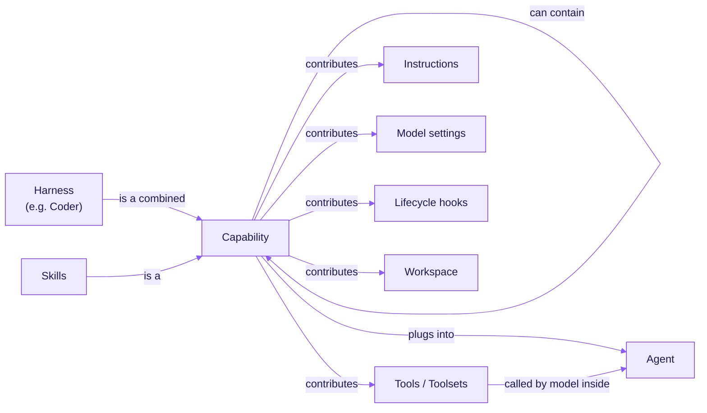

---

## 2. Agents

An agent is configured once (usually at module level) and run many times.

```python
from dataclasses import dataclass
from pydantic import BaseModel
from pydantic_ai import Agent, RunContext


@dataclass
class Deps:
    user_id: str
    db: "Database"


class Answer(BaseModel):
    summary: str
    confidence: float


support_agent = Agent(
    'anthropic:claude-sonnet-5-5',
    deps_type=Deps,
    output_type=Answer,
    instructions='You are a support agent. Be concise.',
)


@support_agent.instructions
async def user_context(ctx: RunContext[Deps]) -> str:
    user = await ctx.deps.db.get_user(ctx.deps.user_id)
    return f"The user's name is {user.name}."


result = await support_agent.run('Why was I charged twice?', deps=Deps('u_123', db))
result.output  # -> Answer(summary=..., confidence=...)
```

### Ways to run an agent

| Method | Use when |
|---|---|
| `await agent.run(...)` | Normal async call, returns the final result |
| `agent.run_sync(...)` | Scripts / tests without an event loop |
| `async with agent.run_stream(...)` | Stream text or partially-validated structured output to a client |
| `async with agent.iter(...)` | Step through the loop node by node (full control) |

### What happens inside one run

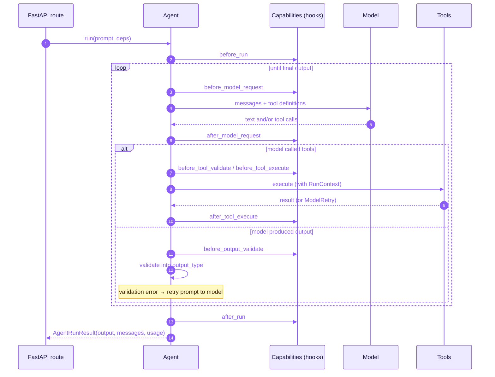

### Output types

| Output | How |
|---|---|
| Plain text | `output_type=str` (default) |
| Validated object | `output_type=MyModel` (Pydantic model, dataclass, TypedDict) |
| One of several shapes | `output_type=[Success, Failure]` |
| Choose the mechanism | `ToolOutput(...)`, `NativeOutput(...)`, `PromptedOutput(...)`, `TextOutput(fn)` |
| Schema built at runtime | `StructuredDict(json_schema)` |

Add `@agent.output_validator` to check the result yourself and raise `ModelRetry('...')` to make the model try again.

---

## 3. Tools & toolsets

A **tool** is a Python function the model can call. Its type hints and docstring become the JSON schema the model sees.

```python
@support_agent.tool
async def lookup_charges(ctx: RunContext[Deps], month: str) -> list[dict]:
    """List the user's charges for a month (YYYY-MM)."""
    return await ctx.deps.db.charges(ctx.deps.user_id, month)


@support_agent.tool_plain  # no RunContext needed
def add(a: int, b: int) -> int:
    return a + b
```

### Where tools come from

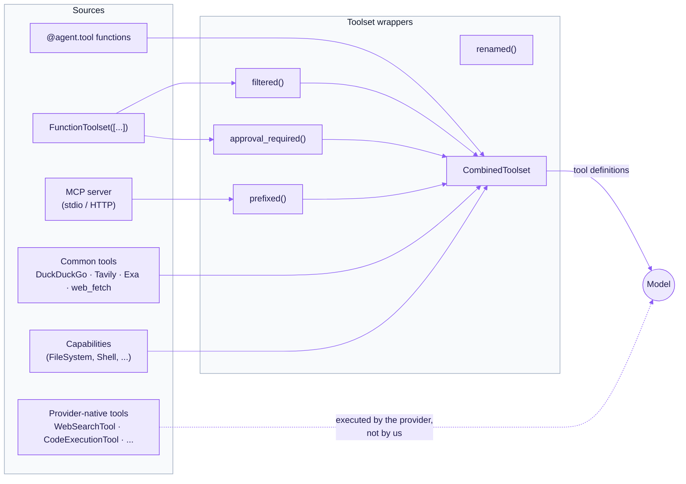

### Tool features worth knowing

| Feature | What it does |
|---|---|
| `ModelRetry` | Raise inside a tool to send an error back to the model so it can try again |
| `ApprovalRequired` / `approval_required()` | Pause the run until a human approves the call (human-in-the-loop) |
| `CallDeferred` / `ExternalToolset` | Return control to the caller, who runs the tool elsewhere (e.g. in the browser) |
| `ToolSearch` capability | Load tool definitions on demand instead of sending hundreds in every prompt |
| `prepare=` | Change or hide a tool per step, based on context |

---

## 4. Capabilities

A **capability** is a reusable unit of agent behavior that you add with `capabilities=[...]`. It's the main way to extend an agent without changing its code.

A single capability can contribute any mix of the following:

```mermaid
%%{init: {'theme': 'base', 'themeVariables': {'fontFamily': 'ui-sans-serif, system-ui, sans-serif', 'primaryColor': '#ede9fe', 'primaryTextColor': '#1e1b4b', 'primaryBorderColor': '#7c3aed', 'secondaryColor': '#e0f2fe', 'secondaryTextColor': '#0c4a6e', 'secondaryBorderColor': '#0284c7', 'tertiaryColor': '#f1f5f9', 'tertiaryTextColor': '#0f172a', 'tertiaryBorderColor': '#64748b', 'lineColor': '#8b5cf6', 'textColor': '#8b5cf6', 'clusterBkg': '#f8fafc', 'clusterBorder': '#94a3b8', 'titleColor': '#0f172a', 'edgeLabelBackground': '#ede9fe', 'actorBkg': '#ede9fe', 'actorBorder': '#7c3aed', 'actorTextColor': '#1e1b4b', 'actorLineColor': '#8b5cf6', 'signalColor': '#8b5cf6', 'signalTextColor': '#8b5cf6', 'labelBoxBkgColor': '#ede9fe', 'labelBoxBorderColor': '#7c3aed', 'labelTextColor': '#1e1b4b', 'loopTextColor': '#8b5cf6', 'noteBkgColor': '#fef9c3', 'noteBorderColor': '#ca8a04', 'noteTextColor': '#422006', 'sequenceNumberColor': '#ffffff'}}}%%
flowchart TB
    CAP["AbstractCapability"]
    CAP --> I["get_instructions()<br/>adds to the system prompt"]
    CAP --> T["get_toolset()<br/>adds tools"]
    CAP --> N["get_native_tools()<br/>adds provider-native tools"]
    CAP --> S["get_model_settings()<br/>e.g. thinking effort"]
    CAP --> W["get_workspace()<br/>where files & commands live"]
    CAP --> PT["prepare_tools()<br/>filter / edit tools per step"]
    CAP --> HK["Lifecycle hooks"]
    HK --> h1["before_/after_/wrap_ run"]
    HK --> h2["before_/after_/wrap_ model_request"]
    HK --> h3["before_/after_/wrap_ tool_validate / tool_execute"]
    HK --> h4["before_/after_/wrap_ output_validate"]
    HK --> h5["on_event · on_*_error"]
```

### Core capabilities (ship with `pydantic-ai`)

| Capability | Purpose |
|---|---|
| `WebSearch`, `WebFetch`, `XSearch` | Provider-native where supported, local fallback otherwise |
| `Thinking` | Extended thinking at a configurable effort, adapted to each provider |
| `MCP` | Attach an MCP server's tools |
| `ImageGeneration` | Generate and edit images |
| `LocalWorkspace` | Let the agent read files and run commands in a local directory |
| `ToolSearch` | Load tools on demand |
| `Hooks` | Register lifecycle hooks with decorators (no subclass needed) |
| `ProcessHistory` / `HistoryProcessor` | Trim or summarize message history |
| `ReinjectSystemPrompt` | Re-add the system prompt in long runs |
| `SelectModel`, `ResolveModelId` | Pick or route models per run |
| `PrepareTools`, `PrefixTools`, `SetToolMetadata` | Change tools in bulk |
| `HandleDeferredToolCalls` | Resolve approval-deferred calls in code |
| `Instrumentation` | OpenTelemetry spans (Logfire) |
| `UseThreadExecutor` | Run sync tools on a shared thread pool |

### Using hooks without writing a class

```python
from pydantic_ai.capabilities import Hooks

hooks = Hooks()


@hooks.on.before_model_request
async def log_request(ctx, request_context):
    logger.info('model request', extra={'run_step': ctx.run_step})
    return request_context


agent = Agent('anthropic:claude-sonnet-5-5', capabilities=[hooks])
```

### Writing your own capability

Subclass `AbstractCapability` and override only the parts you need:

```python
from dataclasses import dataclass
from pydantic_ai.capabilities import AbstractCapability


@dataclass
class TenantPolicy(AbstractCapability):
    tenant: str

    def get_instructions(self):
        return f'You act on behalf of tenant {self.tenant}. Never reveal other tenants\' data.'

    async def before_tool_execute(self, ctx, *, call, tool_def, args):
        audit_log(self.tenant, call.tool_name, args)
        return args
```

> Check the exact hook signatures in `pydantic_ai/capabilities/abstract.py` before overriding a hook. They are keyword-heavy and do change between releases.

### Composition order

Capabilities run in list order. `before_*` hooks run first-to-last, `after_*` hooks run last-to-first, and `wrap_*` hooks nest like middleware:

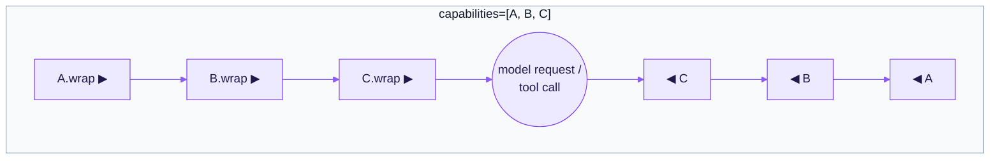

---

## 5. Skills

**Skills** are folders of `SKILL.md` files ([Agent Skills spec](https://agentskills.io/specification)). They hold procedural knowledge that's too long to put in every prompt. The model sees only each skill's **name + description** until it decides it needs one.

### Layout

```text
.agents/skills/
  refund-policy/
    SKILL.md
  write-sql-migration/
    SKILL.md
```

```markdown
---
name: refund-policy
description: Rules for deciding whether a customer is eligible for a refund.
---

1. Check the purchase date against the 30-day window.
2. ...
```

### Wiring it up

```python
from pydantic_ai import Agent
from pydantic_ai_harness.skills import Skills

agent = Agent(
    'anthropic:claude-sonnet-5-5',
    capabilities=[
        Skills('.agents/skills'),                          # all skills
        # Skills('.agents/skills', include=['refund-policy']),  # or a subset
    ],
)
```

### How a skill gets loaded

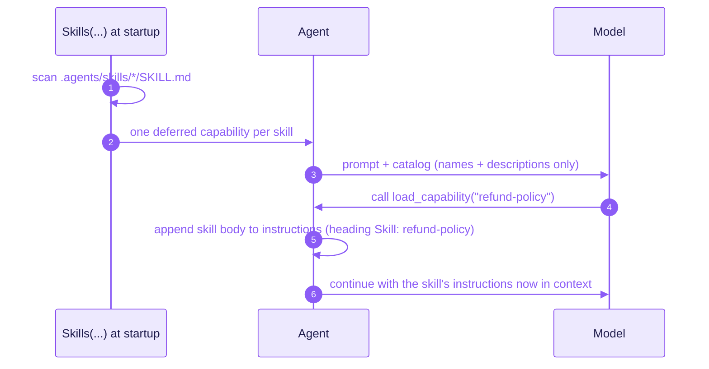

**Notes:**
- Skills are scanned **once at construction**. Create a new `Skills(...)` to pick up changes.
- `Skills` loads only the instructions from `SKILL.md`. It does **not** run scripts or load bundled files.
- A skill's body becomes model instructions, so **load only skills you trust**.
- Requires the `skills` extra (`pydantic-ai-harness[skills]`).

### Skill vs. tool vs. capability: which do I use?

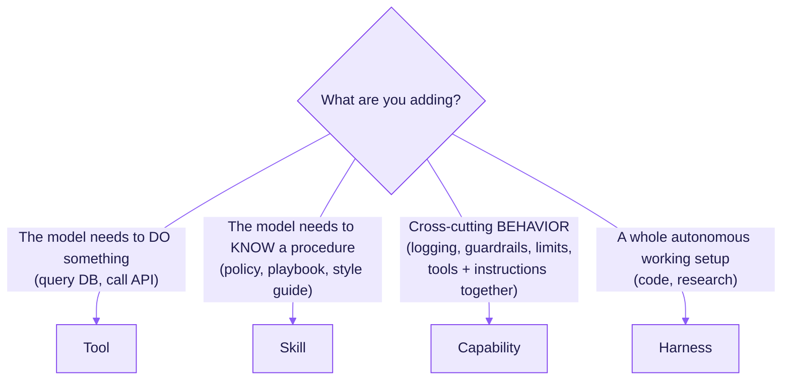

---

## 6. The harness (`pydantic-ai-harness`)

Every agent already has a basic harness: the loop, tools, and typed output. For **long-running, autonomous work** (hours, many files, unattended), the agent needs more around it: somewhere to work, a plan, memory, sub-agents, and context management. `pydantic-ai-harness` provides these as 50+ capabilities, plus two complete pre-built agents.

### A harness is just combined capabilities

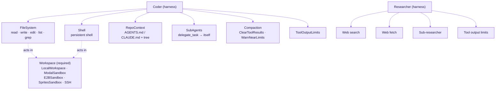

```python
from pydantic_ai import Agent
from pydantic_ai.capabilities import LocalWorkspace, WebSearch
from pydantic_ai_harness import Coder, Memory
from pydantic_ai_harness.memory import FileStore
from pydantic_ai_harness.skills import Skills

agent = Agent(
    'anthropic:claude-opus-5-5',
    capabilities=[
        LocalWorkspace('.'),                  # where files/commands live (NOT a sandbox)
        Coder(),                              # the coding harness
        WebSearch(),                          # core capability
        Memory(FileStore('.agent-memory')),   # remembers across sessions
        Skills('.agents/skills'),             # on-demand procedures
    ],
)
```

> Harness capabilities never pick a workspace for you. If you attach none, the run fails at start and tells you what to add. `LocalWorkspace` runs commands on the host machine, so use a sandbox capability for untrusted work.

### Harness capability catalog

| Group | Capabilities |
|---|---|
| **Harnesses** | `Coder`, `Researcher` |
| **Execution environments** | `FileSystem`, `Shell`, Modal / E2B / Sprites sandboxes, SSH workspace, Bubblewrap |
| **Integrations** | GitHub, Linear, Notion, Google Workspace, Slack, StackOne, PostHog, Pylon, Grain, Day AI, Ordinal, LocalStack, Macroscope |
| **Web & research** | Exa Search / Agent, You.com Search / Research, Playwright Browser, Browser Use |
| **Reasoning & delegation** | `Planning`, `SubAgents`, Dynamic Workflow, `Advisor`, Background Tools |
| **Context management** | Code Mode, `Compaction` (clear / sliding window / summarize), `ToolOutputLimits`, Warn On Cache Busts |
| **Knowledge & memory** | `Memory`, Conversation Search, `Skills`, `RepoContext`, Pydantic AI Docs |
| **Control & safety** | `Guardrails`, Prompt Injection Defender, Spend Limits, Ask User, Repair Tool Arguments, System Reminders, Trajectory Judge |
| **Self-extension** | Capability Creation (the agent writes new capabilities for its next run) |
| **Runtime** | Step Persistence (save / resume / fork runs), AWS Lambda durability, Managed Prompt (Logfire), Logfire MCP |

---

## 7. Multi-agent patterns

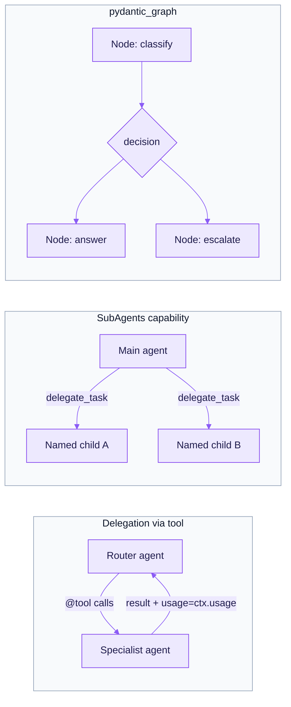

| Pattern | When |
|---|---|
| **Agent delegation** (call another agent inside a tool) | One specialist; pass `usage=ctx.usage` so usage limits apply across both |
| **`SubAgents` / Dynamic Workflow** (harness) | The model decides when and how to fan work out |
| **Programmatic hand-off** (your code picks the next agent) | Deterministic flows |
| **`pydantic_graph`** | Explicit state machines with typed state, branching, fork / join, and resumable persistence |

---

## 8. Around the loop: runtime, observability, testing

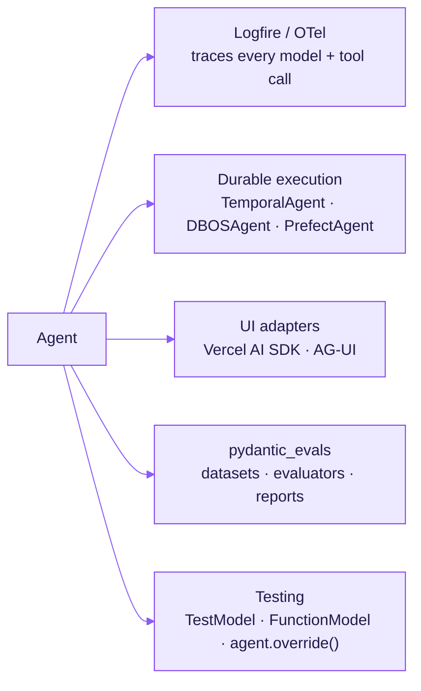

| Area | What to use |
|---|---|
| Observability | `logfire.configure(); logfire.instrument_pydantic_ai()` |
| Cost / usage | `result.usage()`, `UsageLimits(...)`, harness Spend Limits |
| Streaming to the frontend | `pydantic_ai.ui.vercel_ai` (Vercel `useChat`) or `pydantic_ai.ui.ag_ui` |
| Survive restarts | `pydantic_ai.durable_exec.temporal` / `dbos` / `prefect` |
| Unit tests | `agent.override(model=TestModel())`. `TestModel` makes no real API calls |
| Quality evals | `pydantic_evals.Dataset` + evaluators (incl. LLM-as-judge) |

---

## 9. How this maps onto `agent-app`

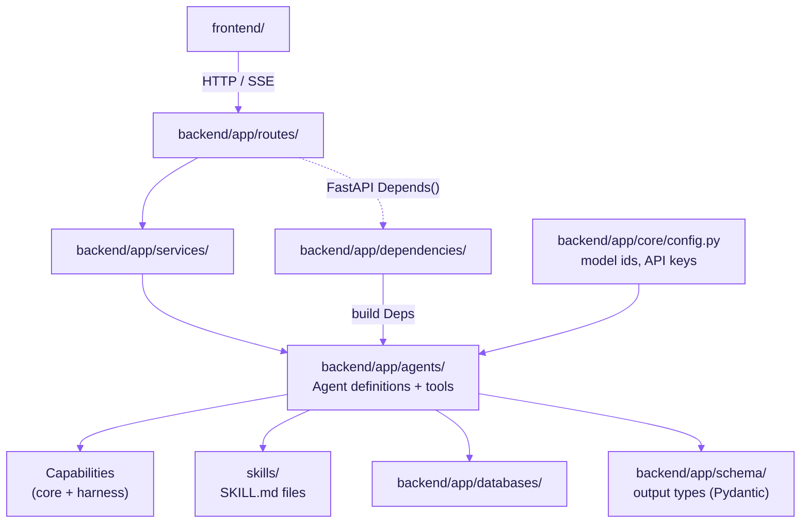

**Conventions:**
- **One agent per module** in `backend/app/agents/`, defined at module level and reused across requests.
- **Request-specific state goes in `deps`**, never in globals. Build `Deps` from FastAPI dependencies.
- **Output types live in `backend/app/schema/`** so routes and agents share them.
- **Use a capability when behavior repeats** across agents (guardrails, logging, tenant policy). Don't copy hooks into each agent.
- **Use a skill when it's knowledge**, a tool when it's an action.
- **Tests use `TestModel` / `FunctionModel`.** No real model calls in CI.

---

## References

- Pydantic AI docs: https://ai.pydantic.dev/
- Capabilities: https://ai.pydantic.dev/capabilities/overview/
- Harness docs: https://pydantic.dev/docs/ai/harness/
- On-demand capabilities & skills: https://pydantic.dev/docs/ai/capabilities/on-demand/
- Agent Skills spec: https://agentskills.io/specification
